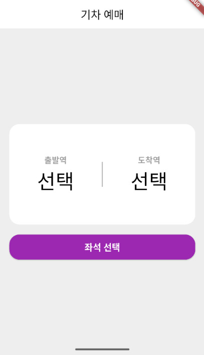
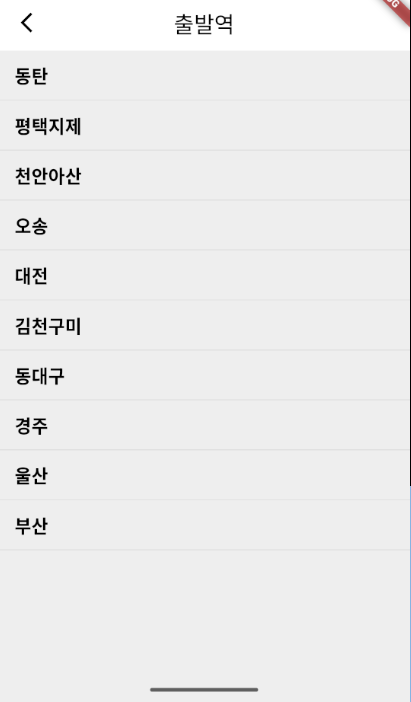
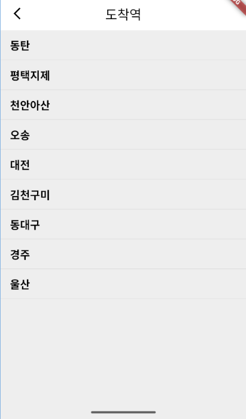
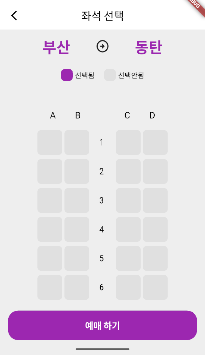
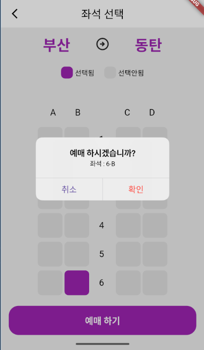

# flutter_train_app

# 기차 예매 앱

Flutter를 이용하여 구현한 기차 예매 앱입니다.  
출발역과 도착역 선택부터 좌석 선택, 예매 확인 및 다크모드 지원(크흠...미완성..)까지 포함된 앱입니다.

---

## 주요 기능

### 1. 출발역 / 도착역 선택
- 출발역과 도착역을 선택할 수 있습니다.
- **출발역에서 선택한 역은 도착역 선택 목록에서 제외**, 반대로도 제외되어 **양방향 중복 방지**를 구현했습니다.

### 2. 좌석 선택
- A-D열 좌석 및 1~20번 행으로 구성된 좌석 UI.
- **좌석 하나만 선택 가능**하며, 이미 선택된 좌석은 보라색으로 표시됩니다.
- 좌석 선택 후 "예매 하기" 버튼을 클릭하면 **선택된 좌석 정보와 함께 알림창**이 출력됩니다.
- 좌석을 선택하지 않고 "예매 하기" 버튼을 클릭하면 아무 일도 일어나지 않습니다.

### 3. 예매 확인 Dialog
- 예매하기 버튼 클릭 시 `CupertinoDialog`가 팝업되어 **선택 좌석 확인 및 예매 확정**이 가능합니다.
- "취소"를 누르면 dialog만 닫히고, "확인"을 누르면 이전 페이지로 두 번 뒤로 이동하여 Home으로 돌아갑니다.

### 4. 다크 테마 지원
- **다크모드 테마**를 지원
- `ThemeMode.dark` 사용으로 다크모드 시 `scaffoldBackgroundColor`, `cardColor`, `textTheme` 등이 반영됩니다.
- 직접 색상을 지정하는 대신 `Theme.of(context)`를 통해 **다크모드 자동 대응**이 되도록 구현했습니다.

---


## 📸 예시 화면

  
- 홈 화면
  
  
- 출발역 선택
  
  
- 도착역 선택
  
  
- 좌석 선택
  
  
- 예매 확인
  

---

## ✅ 실행 방법
```bash
flutter pub get
flutter run
```


